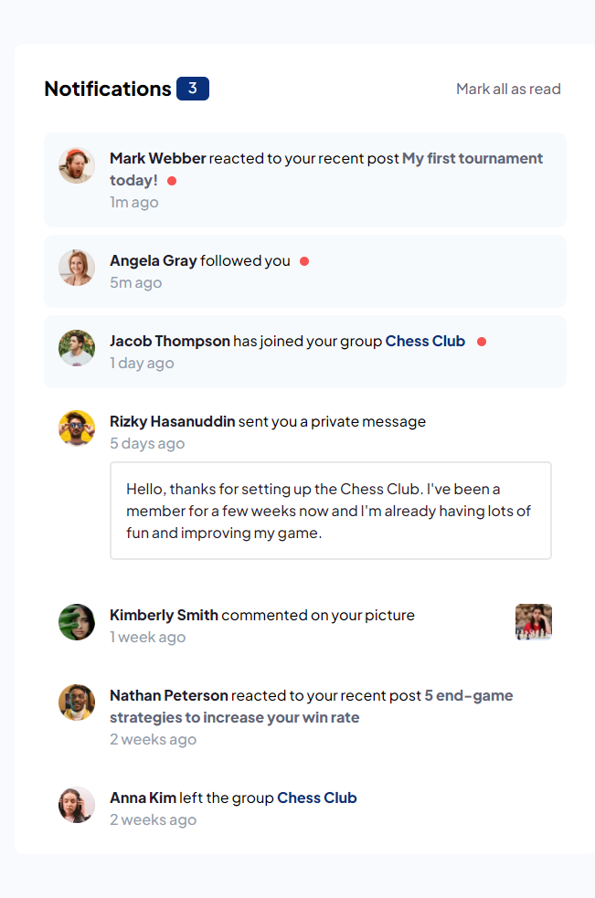

# Frontend Mentor - Notifications page solution

This is a solution to the [Notifications page challenge on Frontend Mentor](https://www.frontendmentor.io/challenges/notifications-page-DqK5QAmKbC). Frontend Mentor challenges help you improve your coding skills by building realistic projects. 

## Table of contents

- [Frontend Mentor - Notifications page solution](#frontend-mentor---notifications-page-solution)
  - [Table of contents](#table-of-contents)
  - [Overview](#overview)
    - [The challenge](#the-challenge)
    - [Screenshot](#screenshot)
    - [Links](#links)
  - [My process](#my-process)
    - [Built with](#built-with)
    - [Useful resources](#useful-resources)
  - [Author](#author)

## Overview

### The challenge

Users should be able to:

- Distinguish between "unread" and "read" notifications
- Select "Mark all as read" to toggle the visual state of the unread notifications and set the number of unread messages to zero
- View the optimal layout for the interface depending on their device's screen size
- See hover and focus states for all interactive elements on the page

### Screenshot

### Links

- Solution URL: [GitHub](https://github.com/nicknjagi/notifications-page)
- Live Site URL: [visit↗](https://phenomenal-paletas-63aa89.netlify.app/)

## My process

### Built with

- Semantic HTML5 markup
- Flexbox
- Mobile-first workflow

### Useful resources

- [Resource 1.](https://grid.malven.co/) - A simple visual cheatsheet for CSS Grid layout
- [Resource 2.](https://www.internetingishard.com/html-and-css/flexbox/) - This Flexbox tutorial is a friendly tutorial for modern CSS layouts by [Interneting Is Hard](https://www.internetingishard.com/).

## Author

- Frontend Mentor - [@nicknjagi](https://www.frontendmentor.io/profile/nicknjagi)
- Twitter - [@nick_njagi](https://www.twitter.com/nick_njagi)
